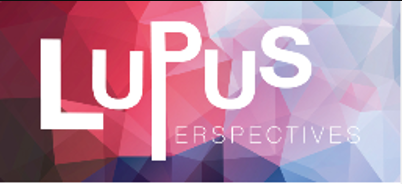
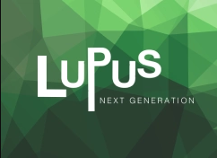
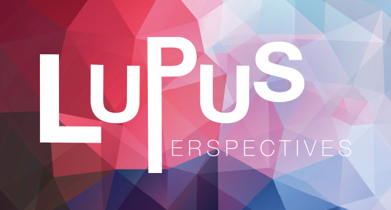
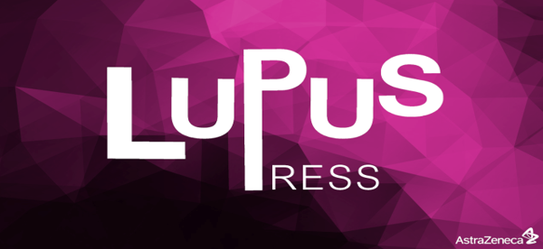
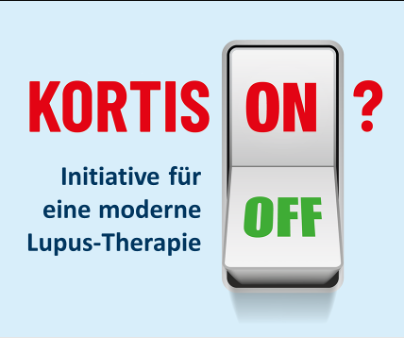
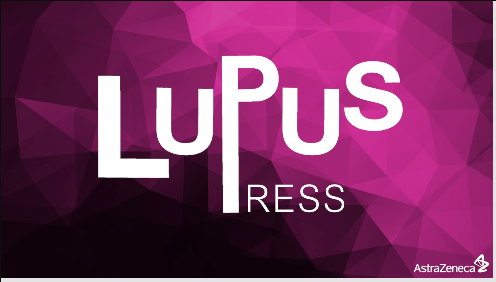
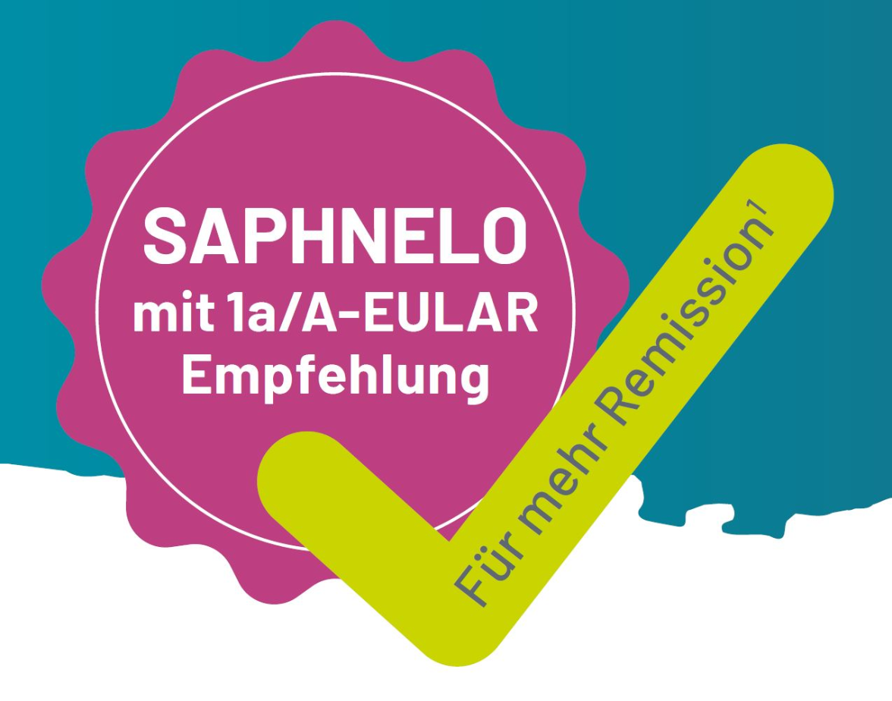
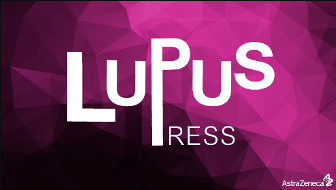

# Systemischer Lupus erythematodes

Der systemische Lupus erythematodes (SLE) ist eine Autoimmunerkrankung aus dem Formenkreis der Kollagenosen. Die Prävalenz in Deutschland liegt bei 37/100.000 Einwohner:innen, wobei zu 90% junge Frauen betroffen sind. Obwohl verschiedene Faktoren bekannt sind, die die Entstehung von SLE begünstigen, ist die exakte Krankheitsursache weiterhin unbekannt. Beim Lupus richtet sich das Immunsystem gegen den eigenen Körper, sodass Autoimmunprozesse entstehen, die jedes Gewebe und damit jedes Organ des Körpers betreffen können. Erfahren Sie mehr über die wissenschaftlichen Hintergründe.

---

| Cards-Resources |  |  |
|---|---|---|
|  | **Deutsche S3-Leitlinie SLE veröffentlicht**  Die wichtigsten Inhalte der ersten deutschen SLE-Leitlinie kompakt für Sie zusammengefasst. | [Mehr erfahren](#) |
|  | **Lupus Perspectives 2025 – Remission und Lupus-Versorgung**  Lupus Perspectives, Hannover. Am 14. und 15. Februar fand zum vierten Mal in Folge das CME-zertifizierte Symposium Lupus Perspectives unter der Leitung von AstraZeneca statt. In kurzen und spannenden Vorträgen vermittelten Expert:innen aus Forschung und Praxis einen umfassenden Einblick in aktuelle sowie zukünftige Entwicklungen der SLE-Versorgung. | [Mehr erfahren](#) |
|  | **Remission und Organschutz mit Anifrolumab**  Die Remission ist das oberste Behandlungsziel bei SLE, da sie nachweislich Organschäden verhindert. Die LASER-Studie zeigt nun erstmals, dass Anifrolumab in Kombination mit Standard of Care für SLE-Patient:innen bereits nach vier Jahren einen signifikant besseren Organschutz bieten kann, als die Standardtherapie allein. | [Mehr erfahren](#) |
|  | **Referent:innen-slidekit Lupus & Anifrolumab**  Präsentationsfolien zum Thema Lupus, Anifrolumab, aktuellen SLE-Leitlinien und vielen weiteren Themen zum Download. | [Mehr erfahren](#) |
|  | **Zusammenfassung der Veranstaltung vom 11. und 12. Oktober 2024**  Zusammenfassung & Highlights der Veranstaltung vom 11. Und 12. Oktober 2024 | [Mehr erfahren](#) |
|  | **Remission auf der Spur – Der Remissions-Bewertungsbogen**  Remission ist ein etabliertes Ziel in der Lupus-Therapie, dass das Risiko von Schüben und Schaden bei SLE-Patient:innen reduziert. Daher ist es von großer Relevanz, die Krankheitsaktivität regelmäßig zu bestimmen. Laden Sie hier den Remissions-Bewertungsbogen herunter. | [Mehr erfahren](#) |
|  | **DGRh Symposien SLE 2024**  Zusammenfassung der SLE-Symposien im Rahmen des 52. Deutschen Rheumatologie-Kongresses in Düsseldorf. | [Mehr erfahren](#) |
|  | **Erste Deutsche S3-Leitlinien zum SLE – Ein neuer Standard für Diagnose und Management**  Deutsche SLE-Leitlinien empfehlen Remission als Therapieziel und frühzeitigen Einsatz von Biologika. | [Mehr erfahren](#) |
|  | **Italienische Real-World Multicenter-Studie zu Anifrolumab bei SLE**  Erste Real-World-Studie zu Anifrolumab bei Lupus | [Mehr erfahren](#) |
|  | **Initiative für eine moderne Lupus Therapie**  „Gemeinsam für eine moderne Lupus-Therapie" – Unter diesem Motto startet die neue SLE-Initiative, die sich an den EULAR Empfehlungen 2023 orientiert. Seien Sie dabei und setzen Sie Ihre Unterschrift für eine ambitionierte Lupus-Therapie. | [Mehr erfahren](#) |
|  | **RheumaLive Kompakt: „Welche Wege führen zur Remission beim Lupus?"**  Zusammenfassung zum AstraZeneca Partner's Satellite mit Rheuma Live vom 25. Juni 2024 | [Mehr erfahren](#) |
|  | **Neues vom EULAR: Studienevidenz bestätigt Effektivität von Anifrolumab bei SLE**  Aktuelle Studiendaten vom EULAR 2024 in Wien zeigen, dass Anifrolumab die Krankheitsaktivität bei systemischem Lupus erythematodes deutlich reduziert, die Glukokortikoid-Dosis senkt und hämatologische Parameter verbessert. | [Mehr erfahren](#) |
|  | **Lupus Perspectives 2024 – Neues zur Behandlung des systemischen Lupus erythematodes (SLE)**  Zusammenfassung zu Lupus Perspectives, der nationalen SLE-Veranstaltung, die vom 01. bis 02.03.2024 in Frankfurt a. M. stattfand. | [Mehr erfahren](#) |
|  | **Infusionsservice zu Hause – Unterstützungsprogramm für Ihre SLE-Patient:innen**  Gemeinsam mit unserem Partner Healthcare Deutschland bieten wir Ihren SLE-Patient:innen, die mit einer Biologika-Zusatztherapie behandelt werden, die Möglichkeit, ihre regelmäßigen Infusionen im eigenen Zuhause zu erhalten. | [Mehr erfahren](#) |
|  | **Mit Saphnelo® früh und anhaltend Remission erreichen**  Remission ist ein etabliertes Ziel in der Lupus-Therapie, dass das Risiko von Schüben, Schaden und weiteren nachteiligen Folgen bei SLE-Patient:innen reduziert. Nun konnte Saphnelo® (Anifrolumab) plus Standardtherapie (ST) zeigen, dass jede dritte Patient:in Remission erreichen kann und dies früher und anhaltender im Gegensatz zu ST alleine. | [Mehr erfahren](#) |
|  | **1 Jahr Anifrolumab - Wesentliche Aspekte zu den Anifrolumab-Daten und Fallbeispiele**  Am 08. Mai 2023 fand die AstraZeneca-Pressekonferenz mit Dr. Philipp Klemm und Prof. Dr. Hanns-Martin Lorenz statt. Die Referierenden stellten die aktuellen Daten zu Anifrolumab vor und sprachen über deren Relevanz in der Therapielandschaft des systemischen Lupus erythematodes (SLE). | [Mehr erfahren](#) |
|  | **EULAR Empfehlungen zum systemischen Lupus erythematodes – Update 2023**  Die EULAR hat ihre Therapieempfehlungen zum Management des SLE aktualisiert. Sie enthalten fünf übergeordnete Therapieprinzipien und 13 spezifische Empfehlungen. Die wichtigsten Neuerungen sind der Steroidschwellenwert von maximal 5mg/Tag, der frühe Einsatz von Biologika, und das Erreichen von Remission oder LLDAS. | [Mehr erfahren](#) |

---

<!-- Content source: https://www.mein-medcampus.de/systemischer-lupus-erythematodes -->
<!-- Mapped: 2025-11-04 -->
<!-- Note: All images downloaded locally to ./images/ folder -->
